# Live Market Anomaly Radar 🚀

**📊 [Link to Live Looker Studio Dashboard](https://datastudio.google.com/reporting/a3f00207-7bb8-45c4-822c-8cde0e2c4567)**

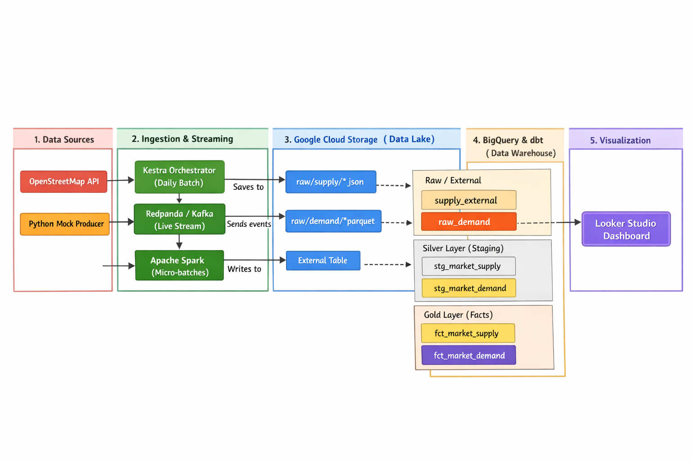

## Project Overview
This project is an end-to-end Data Engineering pipeline designed to identify real-world business opportunities by cross-referencing real-time consumer demand with historical business registry data. 

Instead of static analysis, this architecture acts as a "Live Radar," processing data in two parallel lanes (Lambda Architecture):
1. **Batch Pipeline:** Ingests and transforms bulk historical data (business registries, spatial data) to establish a baseline of existing supply.
2. **Streaming Pipeline:** Captures live consumer intent and trends, joining it with the batch data to spot instant market gaps.

## Technologies Used
* **Cloud Provider:** Google Cloud Platform (GCP)
* **Infrastructure as Code:** Terraform
* **Containerization:** Docker
* **Orchestration:** Kestra
* **Stream Processing:** Apache Kafka & Apache Spark
* **Data Warehouse:** Google BigQuery
* **Data Lake:** Google Cloud Storage (GCS)
* **Transformation:** dbt (Data Build Tool)
* **AI Enrichment:** Bruin / Vertex AI
* **Visualization:** Looker Studio


# Phase-1__Kickoff: Infrastructure as Code
## Docker Initialization and Terraform Setup

- Start the Docker service:
```bash
sudo systemctl start docker
```

- Enable Docker to start on boot:
```bash
sudo systemctl enable docker
```

- Try the check again:
```bash
docker ps
```
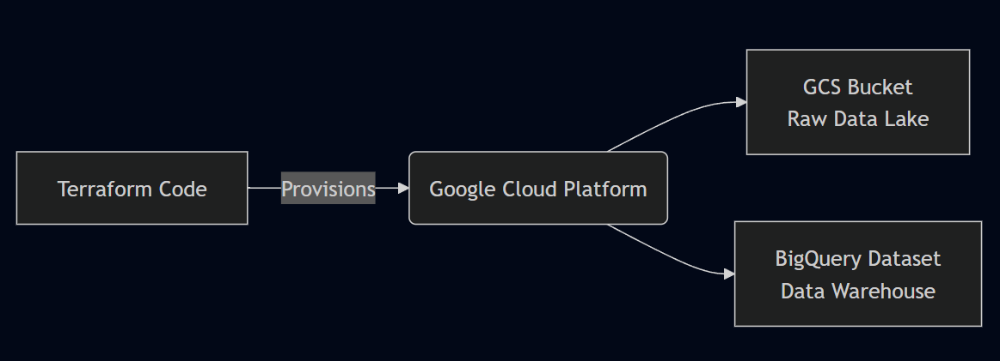
- Inside this Project, I created a seperate terraform folder and inside that I created the following files:

1. [!varables.tf](terraform/variables.tf)
- variables.tf as your configuration dashboard or a dictionary of inputs.
- This file only defines the configuarational variables and their default values. It does not actually build any infrastructure.
2. [!main.tf](terraform/main.tf)
- Our actual blueprint **main.tf**, where the actual heavy lifting happens.

Terraform is **declarative**, So if You just tell it the end state you desire (e.g., "I want a BigQuery dataset and a GCS bucket"), and Terraform figures out the API calls required to make Google Cloud match your code.

Terraform automatically reads and merges all files ending in .tf that are located in the same directory. When you run terraform plan or terraform apply, Terraform essentially stitches variables.tf and main.tf together into one giant configuration in its memory.


1. Set the Authentication Environment Variable
```bash
export GOOGLE_APPLICATION_CREDENTIALS=$(pwd)/gcp-key.json
```

2. Initialize Terraform (Downloads the GCP providers)
```bash
terraform init
```

3. Preview the Architecture Build
```bash
terraform plan
```

4. Build the Infrastructure on GCP
```bash
terraform apply
```

# Phase 2_The Ingestion Layer (Real-Time Radar)

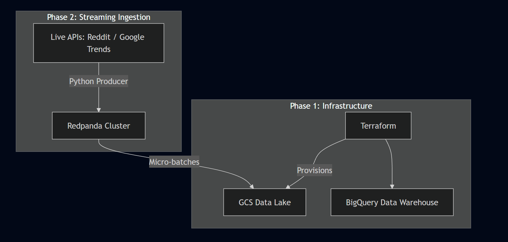

## Ingestion_Setup

### Instead of installing Kafka manually, we will use Docker to spin up the cluster

- So create a directory name **redpanda-cluster** and inside that create a **docker-compose.yml** file.

```YAML
version: '3.7'
services:
  redpanda:
    image: docker.redpanda.com/redpandadata/redpanda:v23.2.19
    container_name: redpanda
    command:
      - redpanda
      - start
      - --smp 1
      - --memory 1G
      - --reserve-memory 0M
      - --overprovisioned
      - --node-id 0
      - --kafka-addr internal://0.0.0.0:9092,external://0.0.0.0:19092
      - --advertise-kafka-addr internal://redpanda:9092,external://localhost:19092
    ports:
      - "19092:19092"
      - "9092:9092"

  redpanda-console:
    image: docker.redpanda.com/redpandadata/console:v2.3.1
    container_name: redpanda-console
    depends_on:
      - redpanda
    ports:
      - "8080:8080"
    environment:
      - KAFKA_BROKERS=redpanda:9092
```

This sets up a single-node Redpanda broker and the Redpanda Web Console:

run:
```bash
docker compose up -d
```

- Now before going to anywhere else, let me first initialize uv folder for helping me in my project management.

1. Run this command followed by installation of the packages:

```bash
uv init
```

2. Add the Kafka dependency:
Instead of using pip install, we tell uv to add it to your project file. It will download the library and lock it in milliseconds:

And Since Redpanda is API-compatible with Kafka, run:

```bash
uv add kafka-python
```

**Before Actually implmenting redpanda, I first wanted to make sure that I am able to run the cluster locally using some test python scripts**
- for that i am creating a mock-producer.py
access it here : [mock-producer.py](streaming-producer/mock-producer.py)

## Test_Ingestion :

after running:
```bash

```

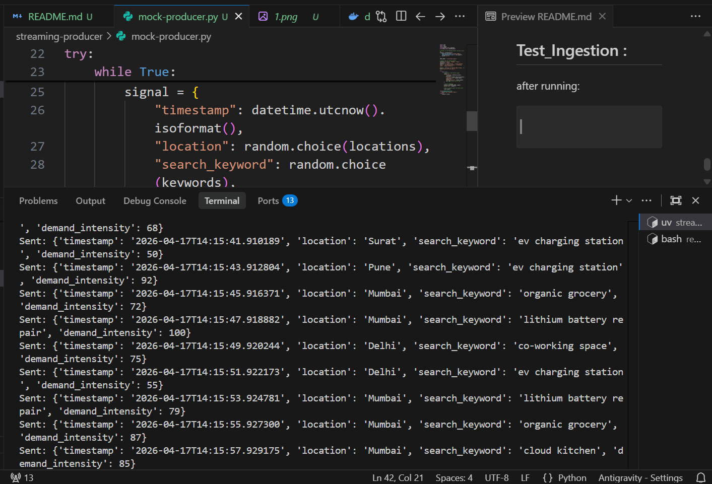

go to http://localhost:8080 and check if the data is flowing in the topic **live-market-signals**
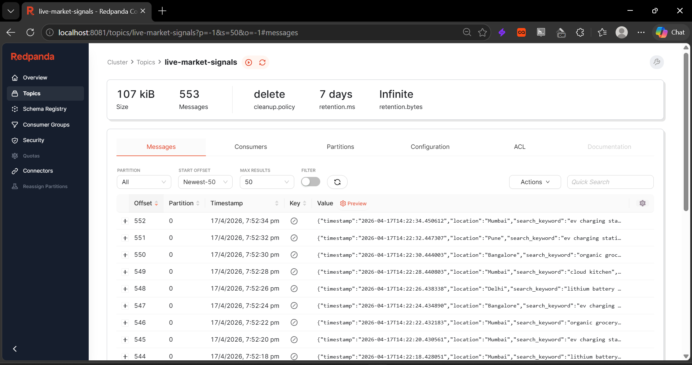


- from image it is clear that the data is flowing in the topic **live-market-signals**

# Phase 3_Big Data Processing with Apache Spark

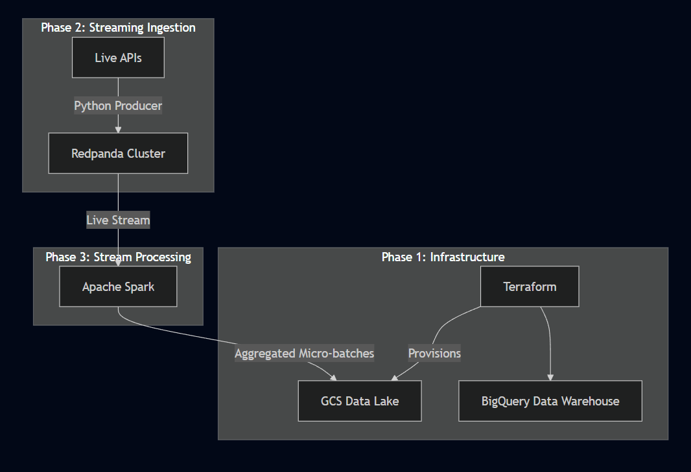

## True Streaming vs. Micro-batching
- True Continuous Streaming (e.g., **Apache Flink**): Processes every single event the exact millisecond it arrives from your Redpanda broker.

- Spark's Approach (**Micro-batching**): Spark treats a live stream of data as a continuous series of very small, incredibly fast batch jobs. It waits for a tiny time window (like 500 milliseconds or 1 second), scoops up all the new messages that arrived in Redpanda during that split second, processes them as one tiny dataset, and outputs the result.

**The kind of tool we are using totally depends on our application requirement.** 

create a folder name **spark-processing** and initialize uv again
<details>
- To keep our dependencies completely isolated.
- PySpark is a massive library, while our streaming producer only needs the lightweight Kafka package.
- If we initialize uv only in the main project folder, we force all our scripts to share one giant, bloated environment. By initializing uv separately in spark-processing and streaming-producer, we create clean, independent environments. This prevents dependency conflicts and mimics how real-world microservices are built.
</details>

- Now add the pyspark dependency:
```bash
uv add pyspark==3.5.1
```
### Our goal is to demonstrate, how to ingest raw byte data from a message broker (Redpanda), enforce a structure on it, perform time-based aggregations (micro-batching), and output the results
### Write the Spark Streaming Job
- Create the script: [stream_processor.py](spark-processing/stream_processor.py)

```bash
uv run stream_processor.py
```
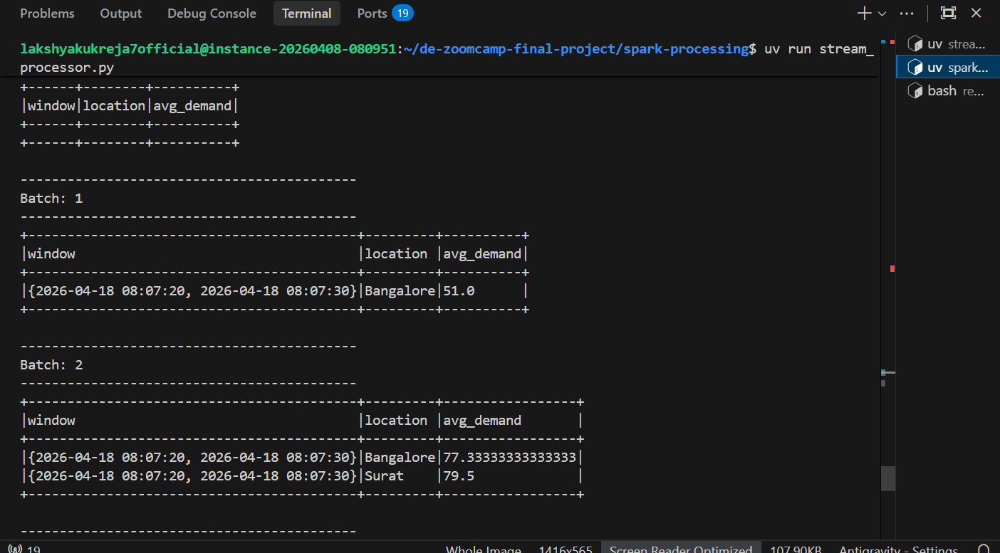


```bash
uv run mock-producer.py
```
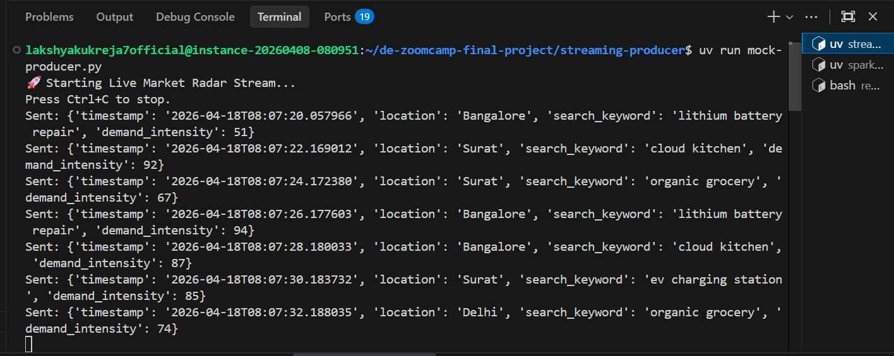


#### Now one may have doubt what if our redpanda topic already contains data:

for checking run:
```bash
docker exec -it redpanda rpk topic consume live-market-signals
```
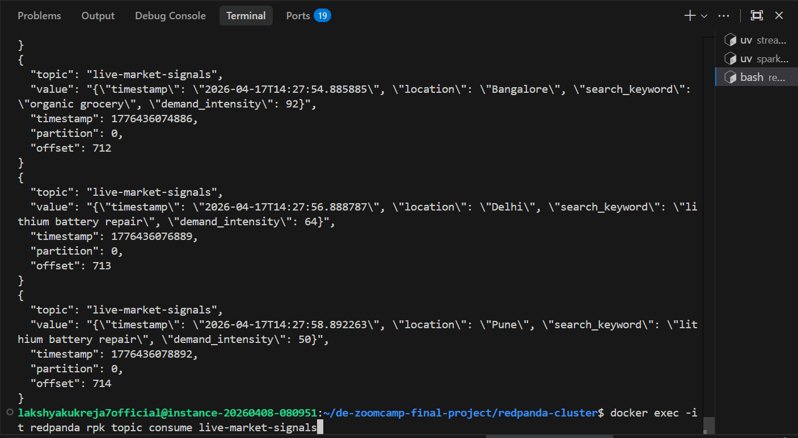

- For now it will not processed as we set option("startingOffsets", "latest")
- But if you want it to be processed from the beginning, you can set option("startingOffsets", "earliest")

#### Execution Steps:
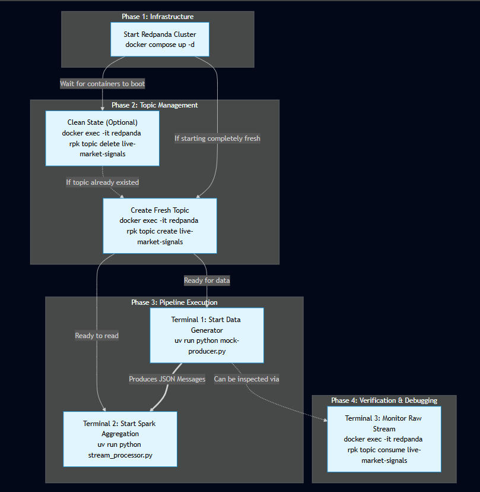

# Phase-4_The Batch Ingestion & Orchestration Layer (Kestra).
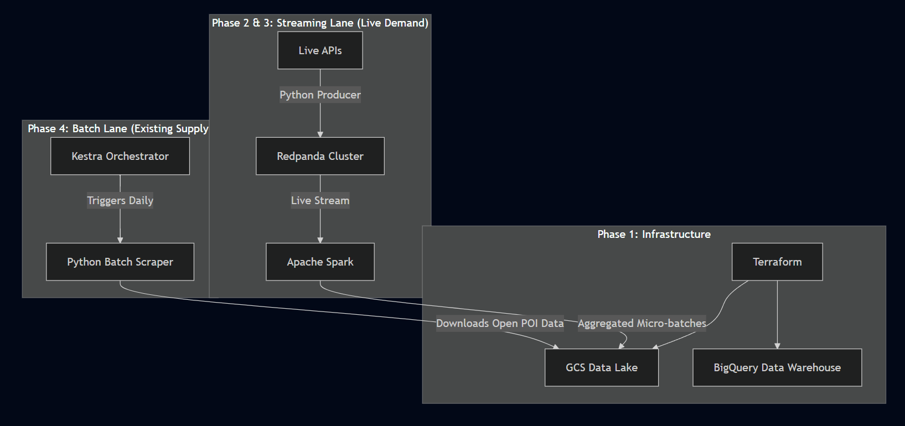

Right now, we know what consumers want (the live stream), but we don't know what businesses already exist in those areas. If 100 people in Surat are searching for a "cloud kitchen," is that a good startup idea? We don't know until we check if there are already 50 cloud kitchens there, or zero.

We are going to use Kestra to schedule a batch Python script that pulls real, open-source Point of Interest (POI) data to establish our baseline of existing businesses.

## Step 1: Deploy Kestra.

- Create the Kestra directory: **kestra-orchestration**
- Download the Kestra Docker Compose file: 
```bash
curl -o docker-compose.yml https://raw.githubusercontent.com/kestra-io/kestra/develop/docker-compose.yml
```
- Start the Kestra Server:
```bash
docker compose up -d
```

for my case the port was 8082: http://localhost:8082


#### for scripts you can navigate:

- [most_optimal.yaml](kestra_scripts/most_optimal.yaml)
- [2nd_script_.yaml](kestra_scripts/2nd_script_.yaml)
- [1st_script.yaml](kestra_scripts/1st_script.yaml)

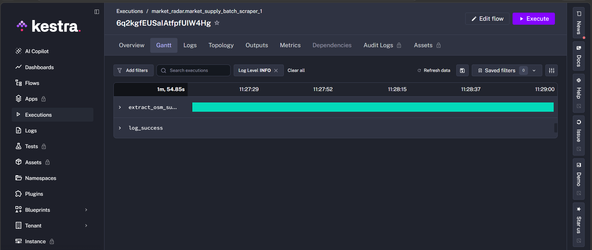
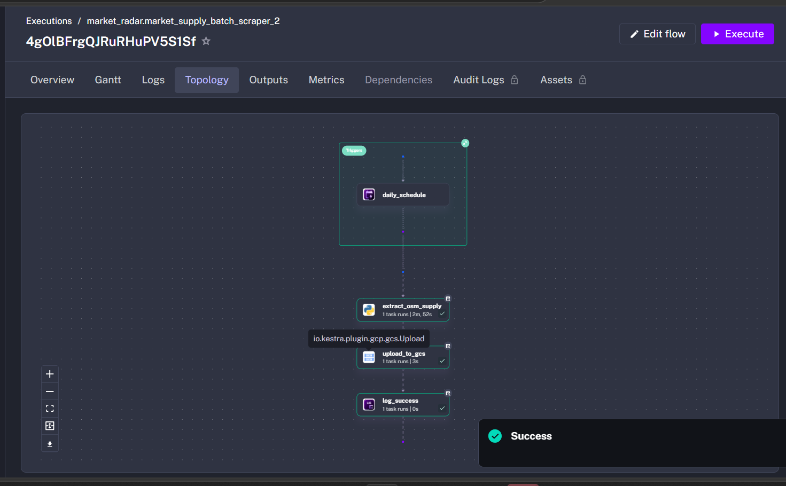
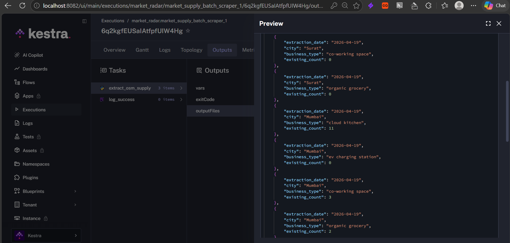
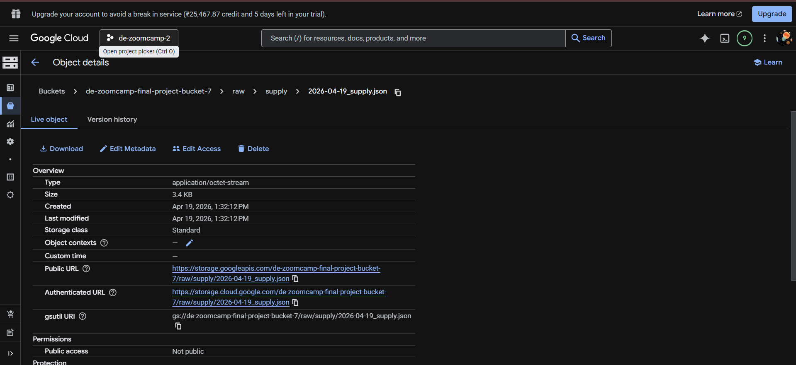
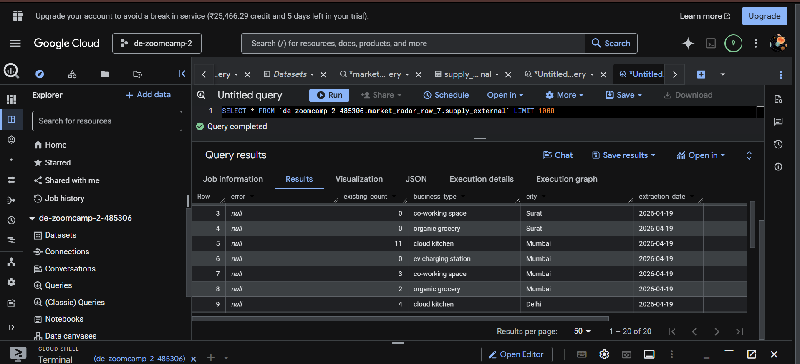
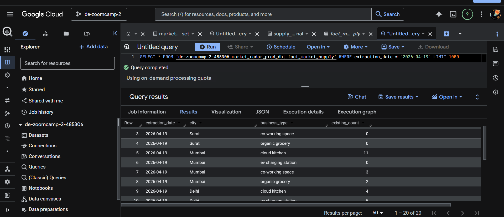

## Step 2: The Batch Scraper.
Since our streaming lane (Redpanda + Spark) is tracking what consumers want right now (demand), this batch lane needs to track what businesses already exist (supply). If 100 people in Surat are searching for a "cloud kitchen," we need to know if there are already 50 cloud kitchens there, or zero.

We are going to use Kestra to run a Python script that queries **OpenStreetMap (Overpass API)**—a free, open-source geographic database—to count the existing businesses in our target Indian cities.

<details><summary>Overpass API-use_case</summary>
To understand the Overpass API, it helps to break it down into two parts: the data source (OpenStreetMap) and the tool itself (the API).

1. The Data: OpenStreetMap (OSM)
Think of OpenStreetMap as the "Wikipedia of maps." It is a massive, open-source database containing billions of data points about the physical world—roads, buildings, EV charging stations, organic grocery stores, and cloud kitchens. If you were to download the entire map of the world, it would be hundreds of gigabytes of raw data.

2. The Tool: Overpass API
When building a data pipeline, downloading that massive dataset just to find a few specific businesses in five Indian cities would be incredibly inefficient.

This is where the Overpass API comes in. It is a specialized, read-only search engine built specifically for OpenStreetMap data.

Instead of downloading the whole map, your script acts as a client and sends a specific "request" to the Overpass API server.

Here is the exact interaction happening in your script:

-   Your Script (The Query): "Hey Overpass API, look at the coordinates for Mumbai. Scan a 15km radius and count every map node that has the tags amenity=restaurant and delivery=yes. Don't send me the map, just send me the final count in a JSON format."

- Overpass API (The Processing): The API searches the massive OpenStreetMap database on its own servers, does the counting, and packages the result.

- The Response: The API sends back a tiny, lightweight JSON response (e.g., {"nodes": 142}), which your script safely extracts and saves to supply_data.json.

</details>


The Purpose We Just Accomplished
We just built the second half of the equation: Existing Supply.

- Phase 3 (Streaming): Tracks Live Demand (how many people are searching for a "cloud kitchen").

- Phase 4 (Batch): Tracks Existing Supply (how many "cloud kitchens" actually exist in that city).

The Ultimate Goal: By the end of this project, we will join these two pipelines together. When the system detects High Demand but Low Supply in a specific city, it triggers an alert. That is our "Market Anomaly"—a profitable startup opportunity.

- **Now we are officially connected the batch scraper to your gcs data lake!.**


# Phase 5: Activating the Live Stream

In a real-world enterprise pipeline, that Redpanda stream would be connected to a live API like Google Trends, Twitter/X firehose, or internal app search logs. Since those APIs are expensive and hard to set up for a personal project, we simulate the data so your Apache Spark consumer has something to process.

Here is exactly what that simulated demand represents for your Market Radar project:

1. What type of Demand?
It represents Consumer Intent. While your Kestra/OpenStreetMap batch job scrapes what already exists (the Supply), this streaming job captures what people in cities like Surat or Mumbai are actively looking for right now (the Demand).

2. What is the Sentiment Score?
Sentiment score is an AI or NLP (Natural Language Processing) metric that measures the emotion behind a text. It usually ranges from -1.0 (Very Negative) to 1.0 (Very Positive).

- Positive Sentiment: "I love the new cloud kitchens popping up!"

- Negative Sentiment: "Why are there no EV charging stations in my area? This is so frustrating."


## Process Flow:
1. Go to redpanda-cluster then:
```bash
docker compose up -d
```

2. Go to streaming-producer then:
```bash
uv run final_mock_producer.py
```
[!final_mock_producer.py](/home/lakshyakukreja7official/de-zoomcamp-final-project/streaming-producer/final_mock_producer.py)

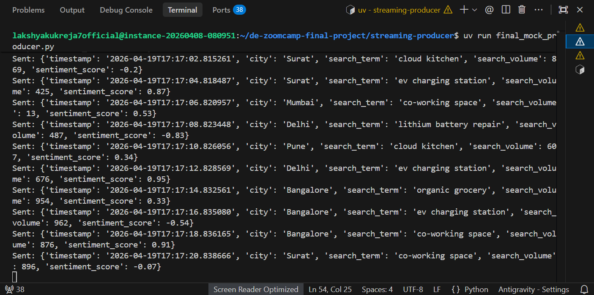

3. Go to spark-processing then:
```bash
uv run final_stream_processor.py
```
[!final_stream_processor.py](/home/lakshyakukreja7official/de-zoomcamp-final-project/spark-processing/final_stream_processor.py)

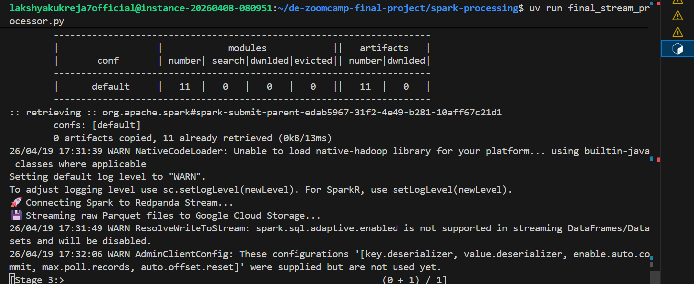
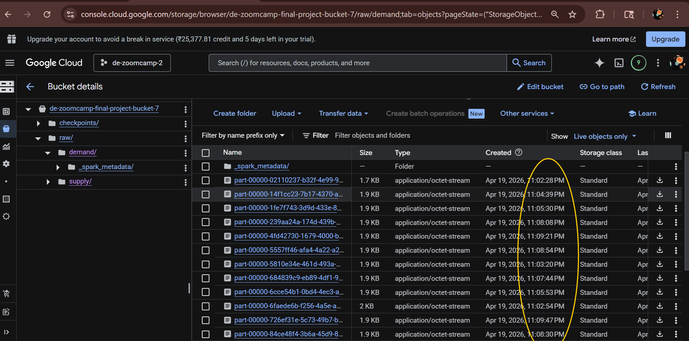


Step 1: Ensure Redpanda is Running:
```bash
cd ~/de-zoomcamp-final-project/streaming-infrastructure
docker compose up -d
```

Step 2: Start the Producer (The Faucet)
- We have a Python script somewhere that acts as the "Live API", generating search demand and sentiment scores and pushing them to a Redpanda topic.

```bash
cd ~/de-zoomcamp-final-project/streaming-scripts
uv run mock_producer.py
```


Step 3: Start the Consumer (The Pipeline)
- Now we need Apache Spark (or Flink) to read those messages, format them, and write them to your GCS bucket as Parquet files. Open a second new terminal window and submit your streaming job:

```bash
cd ~/de-zoomcamp-final-project/streaming-scripts
uv run consumer.py
```

```bash
cd ~/de-zoomcamp-final-project/spark-processing
uv run stream_processor.py
```


write a query in bigquery to create an external table for the raw demand data:
```sql
CREATE OR REPLACE EXTERNAL TABLE `de-zoomcamp-2-485306.market_radar_dataset.raw_demand`
OPTIONS (
  format = 'PARQUET',
  uris = ['gs://de-zoomcamp-final-project-bucket-7/raw/demand/*.parquet']
);
```

View that table:
```sql
SELECT * FROM `de-zoomcamp-2-485306.market_radar_dataset.raw_demand` LIMIT 1000
```
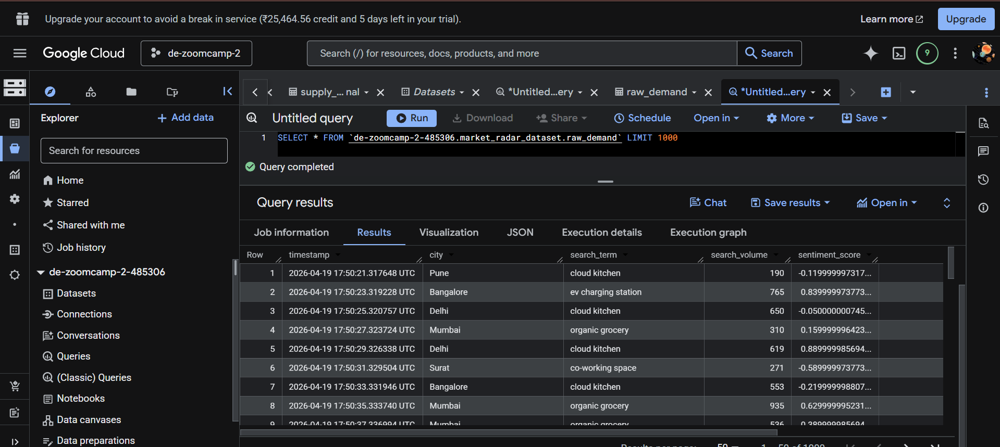


# Phase 6: The Data Lake & Data Warehouse (dbt).
## System Architecture
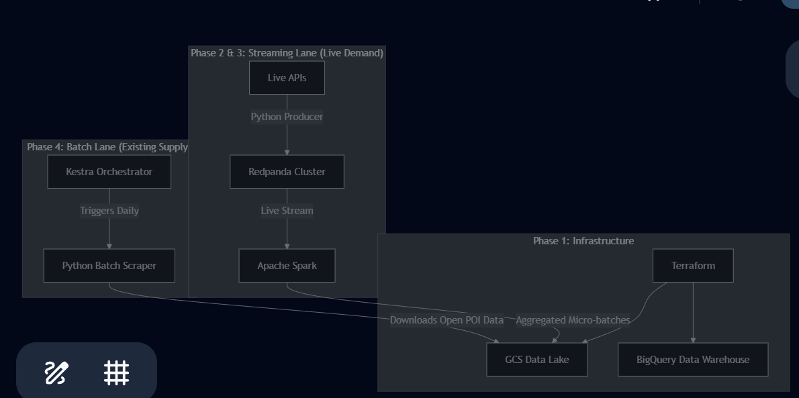


### Step 1: Create the BigQuery Dataset : market_radar_raw_7.
### Step 2: Create the External Table.
```sql
CREATE OR REPLACE EXTERNAL TABLE `de-zoomcamp-2-485306.market_radar_raw_7.supply_external`
OPTIONS (
  format = 'JSON',
  uris = ['gs://de-zoomcamp-final-project-bucket-7/raw/supply/*_robust_supply.json']
);
```

- **Verify:**
```sql
SELECT * FROM `your-gcp-project-id.market_radar_raw.supply_external` LIMIT 20;
```

### Step 3: Initialize dbt:
```bash
cd ~/de-zoomcamp-final-project
mkdir dbt-transformations
cd dbt-transformations
uv init
```

- Add the dbt-bigquery adapter:
```bash
uv add dbt-bigquery
```

- Initialize dbt:
```bash
uv run dbt init market_radar_dbt
```

### Step 4: Test the Connection
```bash
cd market_radar_dbt
uv run dbt debug
```
### Step 5: Write Your dbt Mode:

1. Clean up the default files:
```bash
rm -rf ~/de-zoomcamp-final-project/dbt-transformations/market_radar_dbt/models/example
```


2. Create your staging model:

- pulling from raw_supply, casting data types (CAST(city AS STRING)), and filtering out NULL values

**used_supply_dataset**: market_radar_raw_7
**used_demand_dataset**: market_radar_dataset

### supply staging model
[stg_market_supply.sql](/home/lakshyakukreja7official/de-zoomcamp-final-project/dbt-transformations/market_radar_dbt/models/stg_market_supply.sql)


### demand staging model
[stg_market_demand.sql](/home/lakshyakukreja7official/de-zoomcamp-final-project/dbt-transformations/market_radar_dbt/models/stg_market_demand.sql)

3. Create **marts** or final models:

### supply marts model
[mart_market_supply.sql](/home/lakshyakukreja7official/de-zoomcamp-final-project/dbt-transformations/market_radar_dbt/models/mart_market_supply.sql)


### demand marts model
[mart_market_demand.sql](/home/lakshyakukreja7official/de-zoomcamp-final-project/dbt-transformations/market_radar_dbt/models/mart_market_demand.sql)

### market gaps marts model : THE FINAL MODEL
[mart_market_gaps.sql](/home/lakshyakukreja7official/de-zoomcamp-final-project/dbt-transformations/market_radar_dbt/models/mart_market_gaps.sql)


### Step 6: Build the Production Table

```bash
uv run dbt run
```


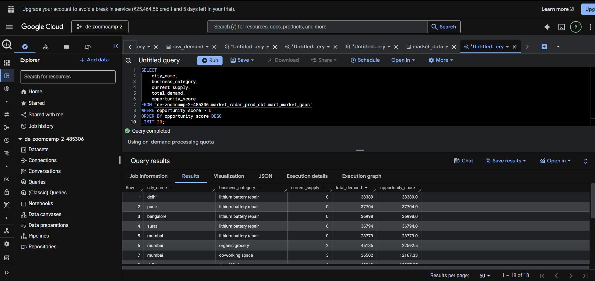

**final_dataset:**market_radar_prod_dbt


### Linux Cron
- The absolute easiest and most reliable way to schedule your dbt run is to bypass Docker entirely and use the VM's built-in scheduler: Cron.

Step 1: Open your terminal and type this command to edit your VM's scheduler
```bash
crontab -e
```

Step 2: Use your arrow keys to scroll to the very bottom of the file and paste this exact line:
```bash
0 9 * * * bash -l -c "cd /home/lakshyakukreja7official/de-zoomcamp-final-project/dbt-transformations/market_radar_dbt && uv run dbt run"
```

# Phase 7: The Presentation Layer (Looker Studio)

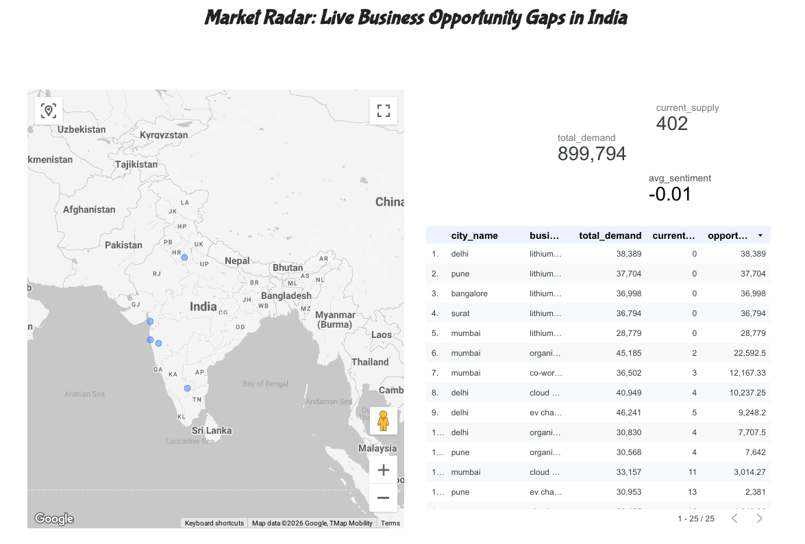
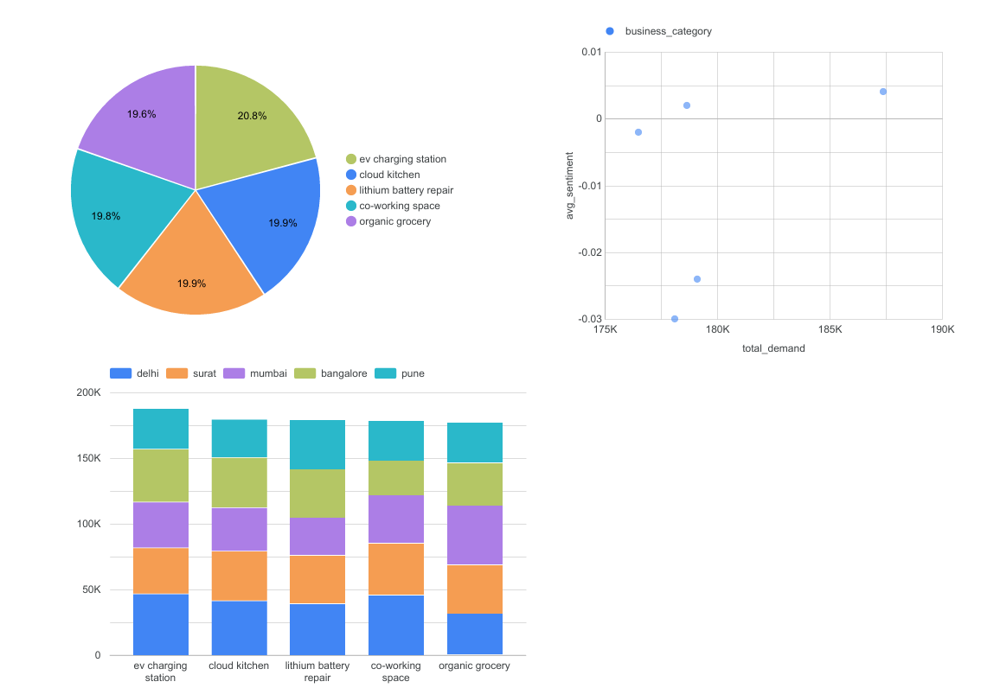