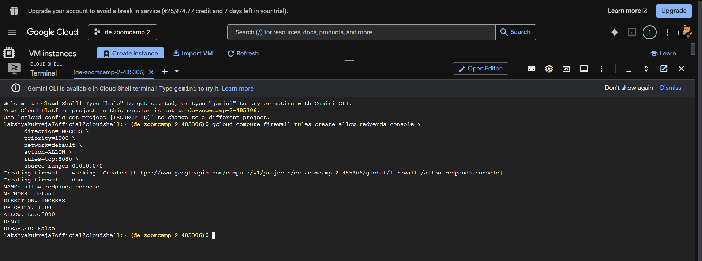

## Working in VM:
For better configuration, I choose work under VM

Update the system and install prerequisites:
```bash
sudo apt-get update
sudo apt-get install -y gnupg software-properties-common curl apt-transport-https ca-certificates lsb-release
```

Install Terraform:
```bash
wget -O- https://apt.releases.hashicorp.com/gpg | gpg --dearmor | sudo tee /usr/share/keyrings/hashicorp-archive-keyring.gpg > /dev/null
echo "deb [signed-by=/usr/share/keyrings/hashicorp-archive-keyring.gpg] https://apt.releases.hashicorp.com $(lsb_release -cs) main" | sudo tee /etc/apt/sources.list.d/hashicorp.list
sudo apt update
sudo apt-get install terraform -y
```

Install Docker & Docker Compose:
```
# Add Docker's official GPG key and repository
curl -fsSL https://download.docker.com/linux/ubuntu/gpg | sudo gpg --dearmor -o /usr/share/keyrings/docker-archive-keyring.gpg
echo "deb [arch=$(dpkg --print-architecture) signed-by=/usr/share/keyrings/docker-archive-keyring.gpg] https://download.docker.com/linux/ubuntu $(lsb_release -cs) stable" | sudo tee /etc/apt/sources.list.d/docker.list > /dev/null

# Install Docker Engine
sudo apt-get update
sudo apt-get install -y docker-ce docker-ce-cli containerd.io docker-compose-plugin

# Add your user to the docker group so you don't have to type 'sudo' every time
sudo usermod -aG docker $USER
```

Reboot and Verify
```bash
terraform --version
docker ps
```

- Start the Docker service:
```bash
sudo systemctl start docker
```

- Enable Docker to start on boot:
```bash
sudo systemctl enable docker
```

- Try the check again:
```bash
docker ps
```

- After you setup your redpanda cluster via docker-compose.yml file, run the following command to start it:
```bash
docker compose up -d
```

- install uv:
```bash
curl -LsSf https://astral.sh/uv/install.sh | sh
```
- for those who don't have musch idea this you can run it anywhere and it will install uv in your system globally and you can use it anywhere in your system.
- for my case it has installed that in my home directory in .local/bin folder.


- Run the following command to activate the uv environment:
```bash
source $HOME/.local/bin/env
```
- check once if your uv is installed in this destination written just after installation.

- just after **uv init** command pyproject.toml file (which is your master list of project settings) and a .python-version file gets created.
And as soon as install some dependencies using **uv add** command, a uv.lock file gets created to lock them.


After running the **mock-producer.py** file, you can check the data flowing in the topic **live-market-signals** by going to http://localhost:8080, 
By default, GCP Compute Engine firewalls block almost all incoming web traffic to your VM to keep it secure. Even though the Redpanda Console is actively listening on port 8080 inside the VM, the Google Cloud firewall is dropping your browser's attempt to connect from the outside.

To fix this, you just need to open port 8080 in your GCP firewall. Since you are already comfortable in the terminal, the CLI method is the fastest, but both methods are below.
So for that change the configuration by  

Method 1: The Fast Way (Using the gcloud CLI):

```bash
gcloud compute firewall-rules create allow-redpanda-console \
    --direction=INGRESS \
    --priority=1000 \
    --network=default \
    --action=ALLOW \
    --rules=tcp:8080 \
    --source-ranges=0.0.0.0/0
```



Method 2: Using the GCP Console (Web UI):
Go to the Google Cloud Console.

1.In the top search bar, type Firewall and select Firewall (VPC network).

2.Click Create Firewall Rule at the top.

3.Fill in the details:

- Name: allow-port-8080

- Targets: Select All instances in the network.

- Source IPv4 ranges: Type 0.0.0.0/0.

- Protocols and ports: Check TCP and type 8080 in the box.

5.Click Create.

**FINAL**: Create a port 8080 in vs code or type **http://[IP_ADDRESS]** **manually** in your browser to access the Redpanda Console. 


### Install Spark Prerequisites
1. Install Java on your VM:
```bash
sudo apt update
sudo apt install default-jre -y
```
2. check once if java is installed:
```bash
java -version
```

##  [stream_processor.py](spark-processing/stream_processor.py)

<details><summary>CODE EXPLAINATION</summary>
1. The Imports

```python
from pyspark.sql import SparkSession
from pyspark.sql.functions import from_json, col, avg, window
from pyspark.sql.types import StructType, StructField, StringType, 
IntegerType, TimestampType
```

- SparkSession: The main entry point for writing PySpark code.

- from_json, col, avg, window: Specific functional tools. from_json parses strings into objects, col selects columns, avg does the math, and window handles the time-slicing.

- StructType, StructField, etc.: The data type classes needed to explicitly define the shape of your incoming data.

Use-Case: You are importing the exact blueprints and tools required to manipulate distributed dataframes without having to write raw map-reduce functions.

2. Initializing the Spark Session

```python
spark = SparkSession.builder \
    .appName("LiveMarketRadar") \
    .config("spark.jars.packages", "org.apache.spark:spark-sql-kafka-0-10_2.12:3.5.1") \
    .getOrCreate()

spark.sparkContext.setLogLevel("WARN")
```

- .builder / .getOrCreate(): This checks if a Spark session is already running. If not, it spins up a new one.

- .appName(...): Names your application. If you check the Spark UI on a cluster, this is the name you will see monitoring the job.

- .config(...): This is the most critical line for this setup. Spark does not know how to talk to Kafka/Redpanda out of the box. This line forces Spark to download the official Kafka connector package (version 3.5.1) before starting.

- .setLogLevel("WARN"): Spark is incredibly noisy and prints hundreds of INFO logs every second. This limits the terminal output to only warnings and errors so you can actually read your data.

- Use-Case: Bootstrapping the distributed processing engine and giving it the network drivers it needs to connect to your streaming source.

3. Defining the Schema

```python
schema = StructType([
    StructField("timestamp", TimestampType(), True),
    StructField("location", StringType(), True),
    StructField("search_keyword", StringType(), True),
    StructField("demand_intensity", IntegerType(), True)
])
```
- StructType([...]): Defines the overarching structure of a row.

- StructField("name", Type(), True): Defines individual columns. The True at the end means the column is "nullable" (it won't crash the pipeline if a row arrives missing this specific piece of data).

- Use-Case: Kafka/Redpanda has no concept of columns or data types; it just moves raw bytes. This schema forces a strict, relational table structure over those chaotic bytes so Spark can run SQL-like operations on them.

4. Reading the Stream

```python
df = spark \
    .readStream \
    .format("kafka") \
    .option("kafka.bootstrap.servers", "localhost:19092") \
    .option("subscribe", "live-market-signals") \
    .option("startingOffsets", "latest") \
    .load()
```

- .readStream: Tells Spark this is a continuous, infinite flow of data, not a static file.

- .format("kafka"): Instructs Spark to use the Kafka connector downloaded earlier. (Redpanda is 100% Kafka API compatible, so you use the Kafka connector).

- .option("kafka.bootstrap.servers", "localhost:19092"): Points Spark to the external port of your Redpanda Docker container.

- .option("subscribe", "live-market-signals"): The specific topic queue Spark is listening to.

- .option("startingOffsets", "latest"): Tells Spark to ignore any old data sitting in Redpanda and only process brand new messages that arrive after this script starts.

- Use-Case: Establishing the persistent network connection to the message broker and grabbing the raw data stream.

5. Parsing the JSON

```python
parsed_df = df.select(
    from_json(col("value").cast("string"), schema).alias("data")
).select("data.*")
```

- col("value").cast("string"): When data comes from Redpanda, the actual payload is hidden inside a column called value and stored in binary. This grabs the binary and casts it into a readable JSON string.

- from_json(..., schema).alias("data"): Applies the structure you built in Step 3 to the raw string, turning it into a complex Spark object named data.

- .select("data.*"): "Flattens" the object. Instead of one column containing a dictionary, it splits it into four distinct columns (timestamp, location, search_keyword, demand_intensity).

-   Use-Case: Data transformation. Turning network bytes into a clean, queryable dataframe.

6. The Real-Time Aggregation

```python
aggregated_df = parsed_df \
    .withWatermark("timestamp", "10 seconds") \
    .groupBy(
        window(col("timestamp"), "10 seconds"),
        col("location")
    ) \
    .agg(avg("demand_intensity").alias("avg_demand"))
```

- .withWatermark("timestamp", "10 seconds"): A critical streaming concept. It tells Spark: "If a message arrives up to 10 seconds late due to network lag, still include it in the calculation. If it is older than 10 seconds, drop it to save memory."

- .groupBy(window(...), col("location")): Slices the infinite stream into 10-second chunks (micro-batches) based on the event time, and then groups those chunks by city/location.

- .agg(avg(...)): Calculates the average demand for each city within that specific 10-second window.

- Use-Case: Deriving business value. This takes raw, noisy event data and turns it into clean, time-bound metrics (e.g., "What was the average demand in Surat between 14:00:00 and 14:00:10?").

7. Outputting the Results

```python
query = aggregated_df \
    .writeStream \
    .outputMode("update") \
    .format("console") \
    .option("truncate", "false") \
    .start()

query.awaitTermination()
```

- .writeStream: The command to actually execute the pipeline and push data to a destination.

- .outputMode("update"): Tells Spark to only print rows to the screen if the calculated average has changed or if a new time window has opened. (You cannot use "append" mode when doing aggregations in streaming).

- .format("console"): Sends the data to your terminal screen instead of a database or storage bucket.

- .start(): Pulls the trigger and begins pulling data from Redpanda.

- .awaitTermination(): Keeps the Python script running indefinitely. Without this line, the script would start the stream and instantly exit, shutting down the pipeline.

- Use-Case: The pipeline sink. In production, you would change "console" to "bigquery" or "parquet" to save the data. Here, it is used for live testing and debugging.
</details>


## Brfore uploading your extracted data to GCS:
dump your keys.json file as a secret variable :
```bash
cat ./gcp_keys.json | base64 -w 0
```
it generates a big text starting from "ewog....", so go and paste it into a .env file in kestra-orchestration folder.

- Then add the following in docker-compose.yml
    ```yaml
        env_file:
        - .env
        
        environment:
        SECRET_GCP_CREDS: ${GCP_B64_KEY}
        KESTRA_CONFIGURATION: |
    ```

    ```yaml
        secret:
            type: env-var
            env-var:
              prefix: SECRET_
          repository:
            type: postgres
          storage:
    ```

```bash
docker compose down && docker compose up -d
```
      

### If your SQL syntax is perfectly fine and BigQuery is successfully locating your file but it is failing to parse the contents.
- Go to cloud shell and fix it :
```bash
for file in $(gsutil ls gs://de-zoomcamp-final-project-bucket-7/raw/supply/*_supply.json); do
  echo "Fixing format for $file..."
  gsutil cat "$file" | jq -c '.[]' | gsutil cp - "$file"
done
```


### While Configuring dbt:
If you ever scale this project to scrape every single city in India, or if you add complex machine learning predictions to your dbt models that take 20 minutes to process, you would bump that configuration to 1800 (30 minutes) or 3600 (1 hour).

and for location changing issue:
```bash
nano ~/.dbt/profiles.yml
```

